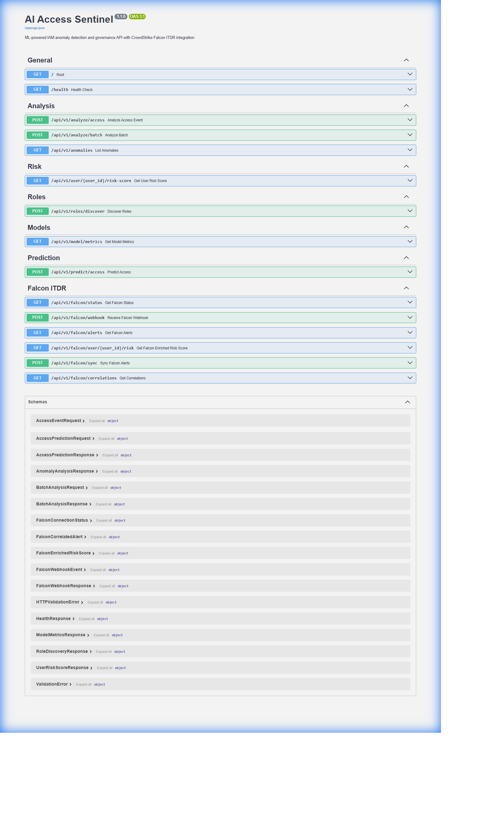

<p align="center">
  
</p>

<h1 align="center">AI Access Sentinel</h1>
<h3 align="center">Identity Threat Detection and Response (ITDR) Platform</h3>

<p align="center">
  
  
  
  
  
  
</p>

<p align="center">
  <strong>ML-powered ITDR platform combining UEBA, anomaly detection, and CrowdStrike Falcon threat intelligence for Zero Trust environments</strong>
</p>

---

## The Problem

<table>
<tr>
<td width="50%">

### Identity-Based Attacks Are #1 Threat Vector

According to industry research:
- **80%** of breaches involve compromised credentials (Verizon DBIR 2024)
- **99%** of organizations experienced identity-based attacks (CrowdStrike 2024)
- **$4.5M** average cost of a data breach (IBM 2024)

Traditional IAM systems are **reactive** - they enforce policies but cannot:
- Detect credential compromise in real-time
- Identify lateral movement patterns
- Predict privilege escalation attempts
- Correlate identity threats across systems

</td>
<td width="50%">

### What Security Teams Need

Modern SOC teams require:
- **Real-time threat detection** for identity attacks
- **Behavioral analytics** to establish baselines
- **ML-powered anomaly detection** at scale
- **Threat intelligence integration** (CrowdStrike, etc.)
- **Automated response** capabilities
- **Risk-based access decisions**

**This is ITDR - Identity Threat Detection and Response.**

</td>
</tr>
</table>

---

## The Solution: AI Access Sentinel

<p align="center">
  
</p>

AI Access Sentinel combines **Machine Learning**, **UEBA (User Entity Behavior Analytics)**, and **CrowdStrike Falcon ITDR** to provide:

| Capability | Technology | Outcome |
|------------|------------|---------|
| **Anomaly Detection** | Isolation Forest, LSTM, Transformer | Detect unusual access patterns in real-time |
| **Risk Scoring** | 6-Factor ML Model | Quantify user risk from 0-100 |
| **Threat Intelligence** | CrowdStrike Falcon ITDR | Correlate with global threat data |
| **Role Mining** | K-Means Clustering | Discover actual vs assigned permissions |
| **Access Prediction** | Random Forest | Recommend approve/deny decisions |

---

## Screenshots

### Dashboard Views

<table>
<tr>
<td align="center" width="33%">

<br/><strong>Anomaly Detection</strong>
<br/>Real-time threat identification
</td>
<td align="center" width="33%">

<br/><strong>Risk Scoring</strong>
<br/>6-factor risk assessment
</td>
<td align="center" width="33%">

<br/><strong>Role Mining</strong>
<br/>ML-discovered access patterns
</td>
</tr>
</table>

### API Documentation

<table>
<tr>
<td align="center">

<br/><strong>Interactive API Documentation</strong>
<br/>Full REST API with Falcon ITDR endpoints
</td>
</tr>
</table>

---

## Why CrowdStrike Falcon ITDR? (v1.1)

<table>
<tr>
<td width="60%">

### The Integration Rationale

CrowdStrike Falcon ITDR was chosen for v1.1 because:

1. **Industry Leader** - Gartner Magic Quadrant leader in endpoint/identity protection
2. **Real-time Threat Intel** - Global visibility into identity attacks
3. **MITRE ATT&CK Mapping** - Native technique/tactic classification
4. **FalconPy SDK** - Official Python SDK for seamless integration
5. **Enterprise Adoption** - Used by Fortune 500 companies globally

### Skills Demonstrated

- API integration with enterprise security tools
- Webhook processing and event correlation
- OAuth2 authentication flows
- Real-time threat intelligence processing

</td>
<td width="40%">

### Before vs After

| Metric | v1.0 | v1.1 |
|--------|------|------|
| Risk Factors | 5 | **6** (+Falcon) |
| Threat Sources | ML only | ML + **Falcon** |
| Attack Types | Anomalies | + **13 ITDR types** |
| Response Time | Minutes | **Seconds** |

### Supported Attack Types

- Credential Theft (T1003)
- Lateral Movement (T1021)
- Privilege Escalation (T1078)
- Brute Force (T1110)
- Golden/Silver Ticket
- Kerberoasting
- DCSync

</td>
</tr>
</table>

---

## Architecture

```
                                    DATA SOURCES
    ┌─────────────────┐    ┌─────────────────┐    ┌─────────────────┐
    │   IAM Logs      │    │  Auth Events    │    │  CrowdStrike    │
    │  (10K+ events)  │    │  (MFA, SSO)     │    │  Falcon ITDR    │
    └────────┬────────┘    └────────┬────────┘    └────────┬────────┘
             │                      │                      │
             └──────────────────────┼──────────────────────┘
                                    │
                                    ▼
    ┌─────────────────────────────────────────────────────────────────┐
    │                    PROCESSING PIPELINE                          │
    │  ┌─────────────┐  ┌─────────────┐  ┌─────────────────────────┐ │
    │  │  Ingestion  │─▶│ Preprocess  │─▶│  Feature Engineering    │ │
    │  │             │  │             │  │  + Falcon Event Parser  │ │
    │  └─────────────┘  └─────────────┘  └─────────────────────────┘ │
    └─────────────────────────────┬───────────────────────────────────┘
                                  │
                                  ▼
    ┌─────────────────────────────────────────────────────────────────┐
    │                    ML + THREAT INTEL SUITE                      │
    │                                                                 │
    │  ┌──────────────┐  ┌──────────────┐  ┌──────────────────────┐  │
    │  │   Anomaly    │  │   Access     │  │  Alert Correlator    │  │
    │  │  Detection   │  │  Prediction  │  │  (Falcon + ML)       │  │
    │  │ ────────────│  │ ────────────│  │ ────────────────────│  │
    │  │ Iso. Forest  │  │ Rand. Forest │  │ Confidence Scoring   │  │
    │  │ LSTM         │  │ 92% Accuracy │  │ MITRE Mapping        │  │
    │  │ Transformer  │  │              │  │                      │  │
    │  └──────────────┘  └──────────────┘  └──────────────────────┘  │
    │                                                                 │
    │  ┌──────────────┐  ┌──────────────┐  ┌──────────────────────┐  │
    │  │ Role Mining  │  │ Risk Scorer  │  │  Falcon Connector    │  │
    │  │ ────────────│  │ ────────────│  │ ────────────────────│  │
    │  │ K-Means      │  │ 6-Factor     │  │ FalconPy SDK         │  │
    │  │ Hierarchical │  │ 0-100 Scale  │  │ OAuth2 + Webhooks    │  │
    │  └──────────────┘  └──────────────┘  └──────────────────────┘  │
    └─────────────────────────────┬───────────────────────────────────┘
                                  │
            ┌─────────────────────┼─────────────────────┐
            ▼                     ▼                     ▼
    ┌──────────────┐      ┌──────────────┐      ┌──────────────┐
    │   FastAPI    │      │  Streamlit   │      │   React      │
    │   REST API   │      │  Dashboard   │      │   Frontend   │
    │              │      │              │      │              │
    │ 15+ Endpoints│      │ Real-time    │      │ Modern UI    │
    │ Falcon ITDR  │      │ Monitoring   │      │ Dark Theme   │
    └──────────────┘      └──────────────┘      └──────────────┘
```

---

## 6-Factor Risk Scoring Model

<table>
<tr>
<td width="50%">

### How It Works

The risk scorer combines 6 weighted factors:

```python
FACTOR_WEIGHTS = {
    'anomaly_score':     22.5%,  # ML detection
    'peer_deviation':    15.0%,  # vs similar users
    'sensitive_access':  15.0%,  # high-value resources
    'failed_attempts':   11.25%, # auth failures
    'policy_violations': 11.25%, # rule breaches
    'falcon_threat':     25.0%,  # CrowdStrike intel
}
```

### Risk Levels

| Score | Level | Action |
|-------|-------|--------|
| 0-30 | LOW | Monitor |
| 31-60 | MEDIUM | Review |
| 61-85 | HIGH | Investigate |
| 86-100 | CRITICAL | Block + Alert |

</td>
<td width="50%">

### Example API Response

```json
{
  "user_id": "U001",
  "risk_score": 78.5,
  "risk_level": "HIGH",
  "factor_scores": {
    "anomaly_score": 65.0,
    "peer_deviation": 45.0,
    "sensitive_access": 72.0,
    "failed_attempts": 30.0,
    "policy_violations": 55.0,
    "falcon_threat": 85.0
  },
  "falcon_context": {
    "active_alerts": 2,
    "alert_types": ["credential_theft"],
    "max_severity": "high"
  },
  "recommendations": [
    "HIGH: Active threat detected",
    "Initiate incident response"
  ]
}
```

</td>
</tr>
</table>

---

## Quick Start

### Prerequisites
- Python 3.9+
- pip package manager

### Installation

```bash
# Clone repository
git clone https://github.com/MikeDominic92/ai-access-sentinel.git
cd ai-access-sentinel

# Create virtual environment
python -m venv venv
source venv/bin/activate  # Windows: venv\Scripts\activate

# Install dependencies
pip install -r requirements.txt

# Configure environment
cp .env.example .env
```

### Run the Platform

```bash
# Start API Server
uvicorn src.api.main:app --reload --port 8000

# Start Dashboard (new terminal)
streamlit run dashboard/app.py

# Start Frontend (new terminal)
cd frontend && npm install && npm run dev
```

### Access Points
- **API Docs**: http://localhost:8000/docs
- **Dashboard**: http://localhost:8501
- **Frontend**: http://localhost:3000

---

## API Endpoints

### Core Endpoints

| Method | Endpoint | Description |
|--------|----------|-------------|
| POST | `/api/v1/analyze/access` | Analyze single access event |
| POST | `/api/v1/analyze/batch` | Batch analysis |
| GET | `/api/v1/user/{id}/risk-score` | Get user risk score |
| POST | `/api/v1/roles/discover` | ML role mining |
| GET | `/api/v1/model/metrics` | Model performance |

### Falcon ITDR Endpoints (v1.1)

| Method | Endpoint | Description |
|--------|----------|-------------|
| POST | `/api/v1/falcon/webhook` | Receive Falcon alerts |
| GET | `/api/v1/falcon/status` | Connection status |
| GET | `/api/v1/falcon/user/{id}/risk` | Falcon-enriched risk |
| POST | `/api/v1/falcon/sync` | Manual alert sync |
| GET | `/api/v1/falcon/correlations` | View correlations |

---

## Use Cases

<table>
<tr>
<td width="50%">

### 1. Credential Compromise Detection

**Scenario**: Attacker steals employee credentials via phishing.

**Detection**:
- Impossible travel (NY to Russia in 10 min)
- Unusual resource access pattern
- Off-hours authentication

**Response**: Block access, force MFA, alert SOC.

**Outcome**: Attack stopped before lateral movement.

</td>
<td width="50%">

### 2. Insider Threat Detection

**Scenario**: Employee downloads sensitive files before resignation.

**Detection**:
- Volume spike in data access
- Off-hours activity increase
- Access to unusual resources

**Response**: Alert security, review access logs.

**Outcome**: Data exfiltration prevented.

</td>
</tr>
<tr>
<td width="50%">

### 3. Privilege Escalation Prevention

**Scenario**: Compromised account requests admin access.

**Detection**:
- 0% of peer group has this access
- Escalation pattern matches known attacks
- Falcon alert: T1078

**Response**: Deny request, flag account.

**Outcome**: Lateral movement blocked.

</td>
<td width="50%">

### 4. Role Optimization

**Scenario**: 200+ custom roles with overlap.

**Discovery**:
- ML clusters users into 15 natural groups
- Identifies 85 ghost permissions
- Finds 30 over-privileged accounts

**Action**: Consolidate roles, reduce attack surface.

**Outcome**: 85% complexity reduction.

</td>
</tr>
</table>

---

## Project Structure

```
ai-access-sentinel/
├── src/
│   ├── api/                 # FastAPI REST endpoints
│   │   ├── main.py          # Application entry point
│   │   └── schemas.py       # Pydantic models + Falcon schemas
│   ├── models/              # ML models
│   │   ├── anomaly_detector.py
│   │   ├── access_predictor.py
│   │   ├── role_miner.py
│   │   └── risk_scorer.py   # 6-factor model
│   ├── integrations/        # v1.1: External integrations
│   │   ├── crowdstrike_connector.py
│   │   ├── falcon_event_parser.py
│   │   └── alert_correlator.py
│   └── data/                # Data generators
├── dashboard/               # Streamlit dashboard
├── frontend/                # React/Next.js UI
├── notebooks/               # Jupyter experiments
├── tests/                   # Test suite (96% coverage)
└── docs/                    # Documentation
```

---

## Skills Demonstrated

This project demonstrates proficiency in:

| Category | Technologies |
|----------|-------------|
| **Machine Learning** | scikit-learn, TensorFlow, LSTM, Transformer, Isolation Forest |
| **Backend Development** | Python, FastAPI, Pydantic, async/await |
| **API Integration** | CrowdStrike FalconPy SDK, OAuth2, Webhooks |
| **Data Engineering** | pandas, numpy, feature engineering |
| **Security** | ITDR, UEBA, MITRE ATT&CK, Zero Trust |
| **Frontend** | React, Next.js, Streamlit |
| **DevOps** | Docker, pytest, CI/CD |

---

## Roadmap

- [x] **v1.0**: Core ML models (Anomaly, Prediction, Clustering)
- [x] **v1.1**: CrowdStrike Falcon ITDR integration
- [ ] **v2.0**: Real-time streaming (Apache Kafka)
- [ ] **v2.1**: SIEM integration (Splunk, Sentinel)
- [ ] **v3.0**: SOAR automated remediation

---

## Author

**Mike Dominic**
- GitHub: [@MikeDominic92](https://github.com/MikeDominic92)
- Focus: IAM Security + AI/ML

---

<p align="center">
  <strong>Built to demonstrate enterprise ITDR capabilities with modern ML techniques.</strong>
  <br/>
  <sub>This is a portfolio project using synthetic data. Production deployment requires security review.</sub>
</p>
