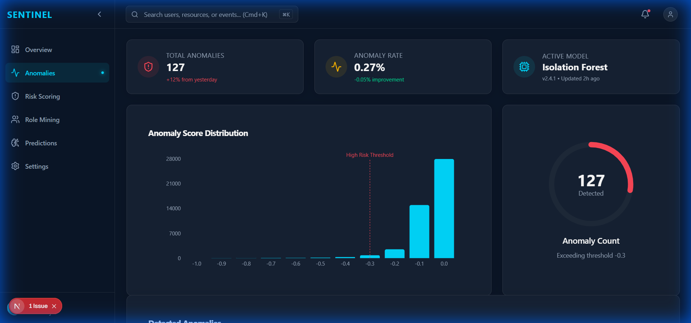
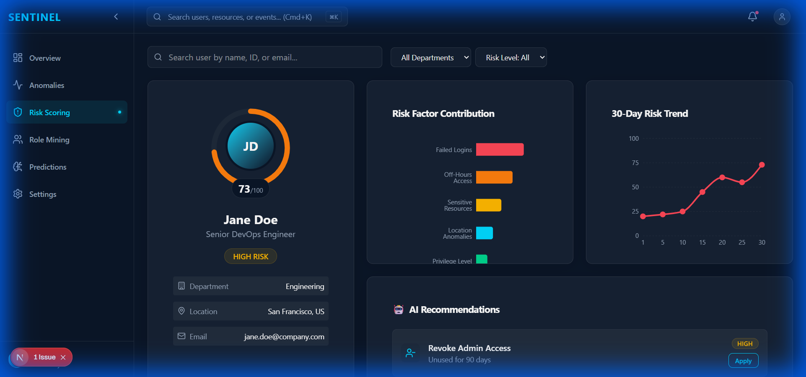
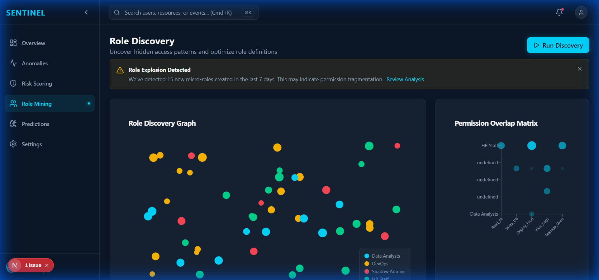
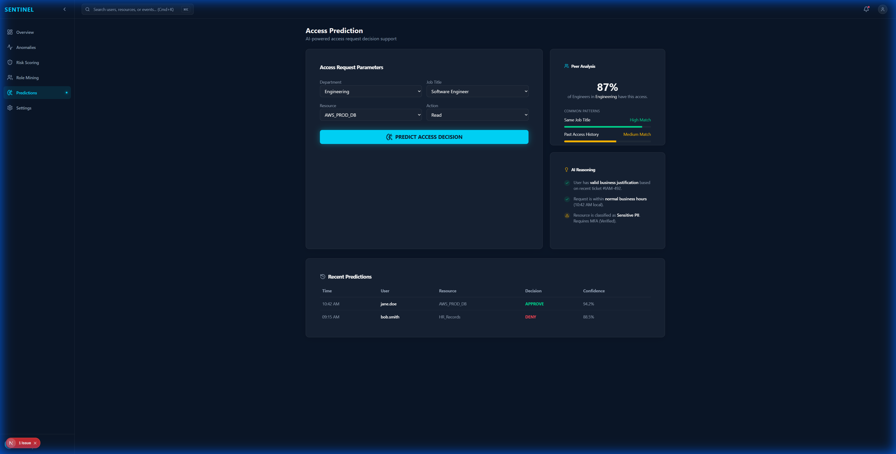
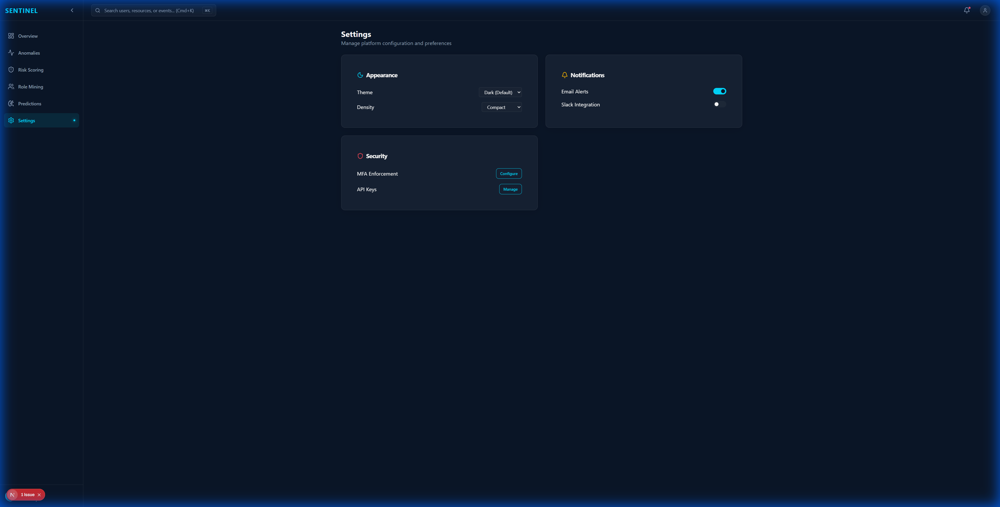

# AI Access Sentinel - Frontend Walkthrough

New React/Next.js frontend for AI Access Sentinel, following the "Tony Stark's JARVIS" design brief.

## Technology Stack

- **Framework**: Next.js 16 with App Router
- **Styling**: Tailwind CSS v4 with custom theme
- **Charts**: Recharts for data visualization
- **Icons**: Lucide React
- **Fonts**: Inter (UI) + JetBrains Mono (data)

## Design System

### Color Palette
| Color | Hex | Usage |
|-------|-----|-------|
| Deep Navy | #0A1628 | Background |
| Electric Cyan | #00D9FF | Accents, highlights |
| Amber Gold | #FFB800 | Warnings |
| Coral Red | #FF4757 | Dangers, anomalies |
| Emerald Green | #00D68F | Success, healthy |
| Slate Gray | #1E2A3A | Cards, surfaces |
| Silver | #94A3B8 | Secondary text |

### Glassmorphism Effects
- `glass-panel`: Frosted glass effect with 12px blur
- `glass-card`: Subtle glass cards with hover effects
- Custom scrollbar styling

## Components

### UI Components
- **Card**: Glass variants with optional neon glow
- **Button**: Multiple variants with neon effects
- **Badge**: Status indicators (success, warning, danger)

### Layout Components
- **Sidebar**: Collapsible navigation with 6 menu items
- **Header**: Search bar and notification area
- **DashboardLayout**: Main wrapper with responsive grid

## Screens

### 1. Main Dashboard (Overview)
- 4 Metric Cards with sparkline charts
- Real-time Threat Feed
- Access Heatmap (day/hour matrix)
- Department Risk Breakdown

### 2. Anomaly Detection Center
- Anomaly Score Distribution histogram
- Detected Anomalies table with expandable details
- Key detection metrics

### 3. User Risk Scoring
- Circular risk dial visualization (0-100)
- Risk factor breakdown chart
- 30-day risk trend timeline
- AI-generated recommendations

### 4. Role Mining
- User cluster visualization
- Discovered role cards
- Permission overlap matrix
- Role explosion warnings

### 5. Access Prediction Interface
- Interactive prediction form
- Animated approval/denial result
- AI reasoning panel
- Similar users comparison

## Screenshots

### Anomaly Detection Center


### User Risk Scoring


### Role Mining


### Access Prediction


### Settings


## Running the Frontend

```bash
cd frontend
npm install
npm run dev
```

Visit http://localhost:3000

## Build

```bash
npm run build
```

## Next Steps

- Connect frontend to backend API (`src/api/main.py`)
- Implement real authentication
- Add WebSocket support for real-time threat feed
- Integrate with ML models for live predictions
